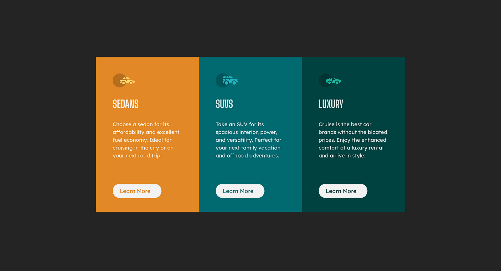
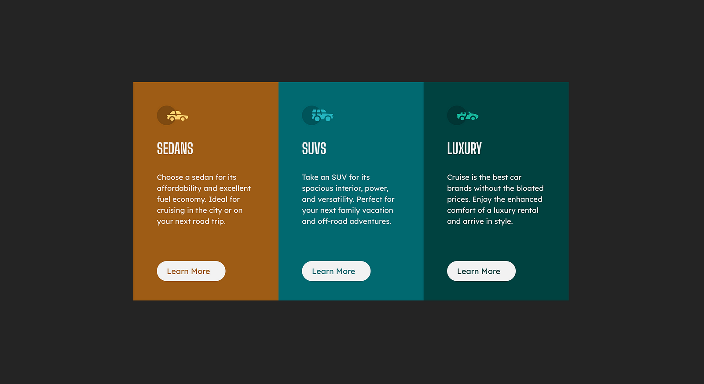

# 3-Column-Preview FrontendMentor Challenge

## To Run the Program
* Make sure npm and vite are installed

``` npm run dev ```

## Challenge
**Link**: https://www.frontendmentor.io/challenges/3column-preview-card-component-pH92eAR2-/hub

**Description of Challenge**: Build a 3 card preview for car preview options with similar styles for each card. The clickable components of this design are the buttons at the bottom that say "Learn More".

### Expected Designs to Replicate

Desktop Design


  Mobile Design

  

## Goals and Motivations for the Challenge

* Easy Challenge to Build on CSS and React Component Knowledge

* Integrate with accessibility to understand any design challenges

## End Result - Without Accessibilty 
  My Web Rendering. Note: Background is Black due to dark-mode on my laptop




  My Mobile Rendering looks the same as the design as the expected, using the same card components that were used for web.

### Key Differences between Expected and Actual

* Text size of the card headings - "SEDANS", "SUVS", "LUXURY" is smaller on my rendering than the expected. 

* Width may be slightly smaller than expected.
* Negligible Differences for the most part
* Since I used the same cards on mobile and web rendering, the mobile rendering leaves identical space between text and button in the card. This space is reduced in the expected design due to shorter cards (in height)

## Accessibilty 

### Issues
Used Firefox Accessibility Inspector to check against standard WAI-ARIA and WCAG metrics. Delved into researching Axe More and Google Lighthouse, identifying similar errors. Next step would be screen readers and other accessibility benchmarks (through automated testing as one step).

Highlights of correcting the issues had to do with creating labels for each of the sections, followed by changing the original design to indicate high contrast.

Primary accessibility issues in label and aria-label, keyboard interfacing, and contrast


### Re-Implemented Accessible Version of the Design (Providing Web View only)



## A Personal Reflection 

### General Takeaways
* Button bottom alignment can be done in 2 ways - flex direction with it being justified at the end, or margin-top / margin-bottom to place the button relative to the body of text and icon (what I ended up doing)

* !important rule on css defines that property to take precedence over the other properties in child or parent components. To avoid this, it is better to not have overlaying same properties and have it defined once if possible
* defining multiple css styles that a component can apply itself to
* did more variable based development of the Card component to eliminate as much hard coded values. Used external variables outside of the component react statement to avoid in-line functionalities
* favicon icons = icons at the title distinction of a page, and its importance (out of an error that came up during development)
* determining screen sizing using window.innerWidth. Upto 640 pixels is considered to be a phone size. Between 640–1000, it is a tablet / ipad size. 1000+ is considered to be a desktop size.
* conditional design based on screen sizes.

### Accessibility Takeaways

* Divs are considered clickable types - assigning a presentation role makes the keyboard interfacing error go away. Only to be done when the screen reader needs to focus on the internal underlying elements of the div

* Section is not a valid use of role as it is an abstract role type. Instead, using "main" and "div" with presentation role for the div helped to give better role assignments
* Forgot to add alt text on the icons
* Learned the importance of aria-labels which are to be used to mark sections and don't have an underlying text between the element declaration

### Things I would do differently next time
* Begin automated testing of the react components to get into the testing practice

* Integrate accessibility development and testing such as highlighted in this article (https://a5h.dev/post/how-to-test-for-a11y-in-react-app-cicd/)
* different component sizes for the mobile version